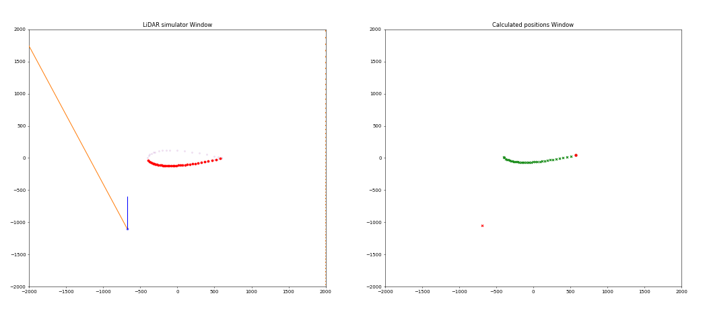
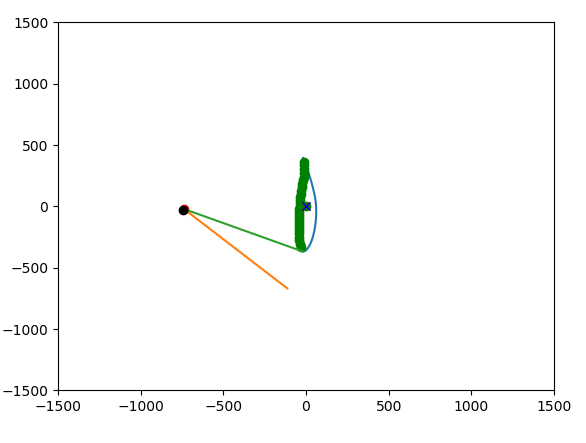
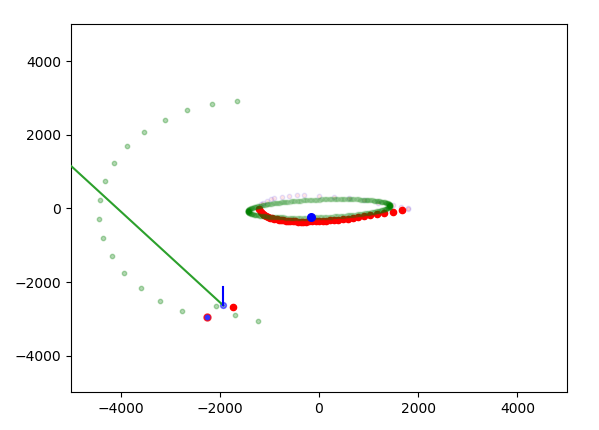

# LiDAR Python 2D Simulations
 A number of simulation scripts for visualizing 2D LiDAR data capturing and the use of the data for positioning of a drone on a wind turbine blade.
 
 All simulations use the idea presented in the paper **Nikolov, I., & Madsen, C. (2017, February). LiDAR-based 2D localization and mapping system using elliptical distance correction models for UAV wind turbine blade inspection. In International Conference on Computer Vision Theory and Applications (Vol. 7, pp. 418-425). SCITEPRESS.**
 
For the purpose of visualization of different wind turbine blade slices, a number of NACA4 models are taken from http://airfoiltools.com/airfoil/naca4digit and used.
 
 
# LiDARBladeSimulation Lite

A liteweight implementation of a LiDAR visualization and simulation code. The code visualizes both a LiDAR sensor and a wind turbine blade, together with what the LiDAR sees and the self positioning of the LiDAR.

The code use the Numpy and Scipy libraries. All necessary functions used for the computation can be found in the **helperComputationFunctions_lite.py** script.

# LiDARBladeSimulation Heavy

A more indepth version of the lite simulation, containing a better animation implementation. Users can select where to position the LiDAR compared to the wind turbine blade, it also visualizes the seen point, as well as the orientation of the LiDAR compared to the tip of the blade. In addition, this implementation can set noise in the visuals of the LiDAR and uses a lineFilter, which can be used to filter out set noise.

The code use the Numpy and Scipy libraries.

# LiDARMovementSimulation

The most complicated implementation. It contains everything featured in the previous two, but also simulates, if the LiDAR has been attached to a drone, which needs to keep a certain distance to the blade. The self-positioning is then used to first find the blade and then keep a certain distance to the blade.Different movement patterns are also present in the **createMovementPattern.py** script, which can be used to add differnt movement patterns.

Example usage:
1. Left click on the figure area to select initial position for the drone/LiDAR.
2. The LiDAR will keep a certain distance between it and the blade. The movement direction will be visualized, as well as the LiDAR's heading
3. By pressing C, the rotation angle of the wind turbine blade will be calculated
4. By pressing V, a model of a ellipse will be fitted to the LiDAR readings seen from the specific position, using the calculated angle
5. Pressing B, will initialize the scanning mode, where the drone/LiDAR will perform a 180 degree scanning on the leading edge of the blade, keeping a specific distance

The code use the Numpy and Scipy libraries.

